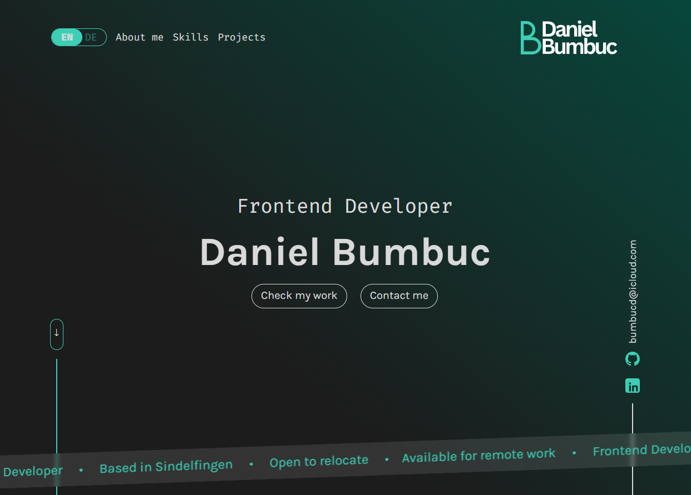

# 🚀 Portfolio

This repository contains the source code for my personal portfolio website. It showcases my projects, technical skills, and professional background, serving as a central place to highlight my work and growth as a developer.

## ✨ Features


<ul>
	<li>💻 Modern and responsive design</li>
	<li>📱 Optimized for desktop and mobile devices</li>
	<li>🚀 Project showcase section</li>
	<li>👨‍💻 About me section</li>
	<li>📬 Contact form</li>
	<li>🎨 Smooth animations and clean UI</li>
	<li>🌐 Professional developer presentation</li>	
</ul>

## 🛠️ Tech Stack

### Frontend


### Tools


## 📸 Screenshots




## ⚙ Installation

Clone the repository:

```bash
  git clone https://github.com/DanielBumbuc/portfolio.git
```

Open the project folder and start the index.html file in your browser.
    
## 💡Lessons Learned

This project helped me reinforce my frontend development skills by applying what I had learned so far. It also gave me more confidence in building responsive, reusable, and well-structured user interfaces.
The main challenge was maintaining a clean, responsive design while keeping the code organized. I addressed this through continuous testing, refactoring, and I'm currently adding subtle scroll animations to create a more engaging user experience.

## 👨‍💻 Developer

Daniel Bumbuc
Aspiring Fullstack Developer from Germany 🇩🇪

